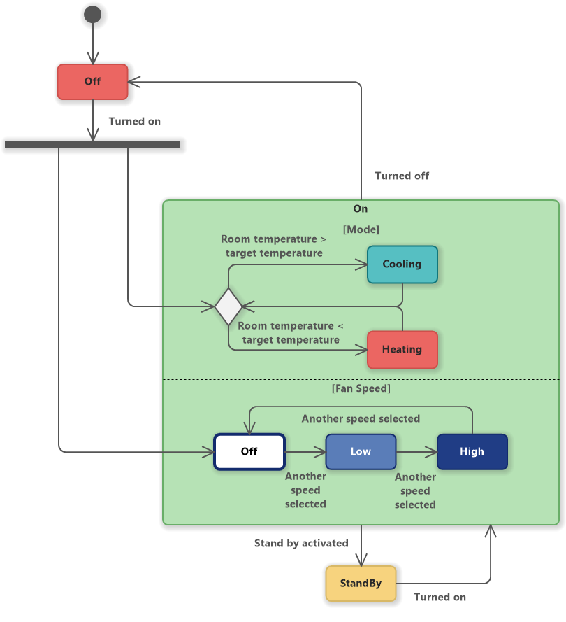

### state design pattern

#### 1. state design pattern

<details>
<summary>state design pattern (course)</summary>
<p>
state DP is a behavioral design pattern that lets an object alter its behavior when its internal state changes. It appears as if the object changed its class.
</p>
 we use state design pattern when we have a lot of if else statements in our code and we want to make it more readable and maintainable.

`state design pattern` terminology:
<ul datatype="square" style="list-style-type:square">
<li><b>state</b>: the state of an object is the set of values of all its attributes at a given time. The state of an object is defined by the class of which it is an instance.</li>
<li><b>context</b>: the context is the object that has a state and can change its state.</li>
<li><b>state</b> interface: the state interface defines the interface of all concrete states. It declares a method for each state, with the same signature, but different implementations.</li>
<li><b>concrete state</b>: each concrete state implements the behavior associated with a state of the context.</li>
</ul>

 

example of state design pattern:
 for example we have a class called `Fan` and it has 3 states: `off`, `low`, `high`. and we want to change the speed of the fan when we call `pullChain()` method. we can do it like this:

daigram of state design pattern:



first the example without state design pattern:

```java
public class Fan {
    private int speed;
    public static final int OFF = 0;
    public static final int LOW = 1;
    public static final int HIGH = 2;

    public Fan() {
        this.speed = OFF;
    }

    public void pullChain() {
        if (speed == OFF) {
            System.out.println("Turning fan on to low.");
            speed = LOW;
        } else if (speed == LOW) {
            System.out.println("Turning fan on to high.");
            speed = HIGH;
        } else if (speed == HIGH) {
            System.out.println("Turning fan off.");
            speed = OFF;
        }
    }

    @Override
    public String toString() {
        if (speed == OFF) {
            return "Fan is off";
        } else if (speed == LOW) {
            return "Fan is on low";
        } else if (speed == HIGH) {
            return "Fan is on high";
        }
        return null;
    }
}
```
example of using state design pattern:

```java
public class Fan {
    //possible states of the fan
    private State toString;
    private State offState;
    private State lowState;
    private State highState;
    //current state
    private State state;

    public Fan() {
        this.state = new Off();
    }

    public void pullChain() {
        state.handleRequest(this);
    }

    public void setState(State state) {
        this.state = state;
    }

    @Override
    public String toString() {
        return state.toString();
    }
}   
```
the `State` interface:
```java
public interface State {
    //handle request this method is called when we call pullChain() method
    void handleRequest(Fan fan);
}
```

the `Off` class:
```java
public class Off implements State {
    @Override
    public void handleRequest(Fan fan) {
        //the logic of the Off state goes here
        System.out.println("Turning fan on to low");
        fan.setState(new Low());
    }

    @Override
    public String toString() {
        return "Fan is off";
    }
}
```

the `Low` class:
```java
public class Low implements State {
    @Override
    public void handleRequest(Fan fan) {
        //the logic of the Low state goes here
        System.out.println("Turning fan on to medium");
        fan.setState(new Medium());
    }

    @Override
    public String toString() {
        return "Fan is on low";
    }
}
```

the `Medium` class:
```java
public class Medium implements State {
    @Override
    public void handleRequest(Fan fan) {
        //the logic of the Medium state goes here
        System.out.println("Turning fan on to high");
        fan.setState(new High());
    }

    @Override
    public String toString() {
        return "Fan is on medium";
    }
}
```

the `High` class:
```java
public class High implements State {
    @Override
    public void handleRequest(Fan fan) {
        //the logic of the High state goes here
        System.out.println("Turning fan off");
        fan.setState(new Off());
    }

    @Override
    public String toString() {
        return "Fan is on high";
    }
}
```
the `Heating` class:
```java
public class Heating implements State {
    @Override
    public void handleRequest(Fan fan) {
        //the logic of the Heating state goes here
        System.out.println("Turning fan on to high");
        fan.setState(new High());
    }

    @Override
    public String toString() {
        return "Heating";
    }
}
```

the `Cooling` class:
```java
public class Cooling implements State {
    @Override
    public void handleRequest(Fan fan) {
        //the logic of the Cooling state goes here
        System.out.println("Turning fan on to medium");
        fan.setState(new Medium());
    }

    @Override
    public String toString() {
        return "Cooling";
    }
}
```

```java
public class Main {
    public static void main(String[] args) {
        Fan fan = new Fan();
        System.out.println(fan);
        fan.pullChain();
        System.out.println(fan);
        fan.pullChain();
        System.out.println(fan);
        fan.pullChain();
        System.out.println(fan);
        fan.pullChain();
        System.out.println(fan);
    }
}
```
 //output:
```java
Fan is off
Turning fan on to low
Fan is on low
Turning fan on to medium
Fan is on medium
Turning fan on to high
Fan is on high
Turning fan off
Fan is off
```
the benifits of using state design pattern:
- we can add new states without changing the existing code.
- we can add new behaviors to the states without changing the existing code.
- for principle of open/closed.
</details>

#### 2. state design pattern (in case of this project)
context: `ATM`  [ :link: ](https://github.com/mohamedBoujdi/ATMStates-Design-Pattern/blob/main/src/main/java/org/example/dp/ATMMachine.java)machine
state interface: `ATMState`[:link:](https://github.com/mohamedBoujdi/ATMStates-Design-Pattern/blob/main/src/main/java/org/example/dp/ATMState.java) interface
concrete state: `NoCard` [:link:](https://github.com/mohamedBoujdi/ATMStates-Design-Pattern/blob/main/src/main/java/org/example/dp/NoCard.java), `HasCard`[:link:](https://github.com/mohamedBoujdi/ATMStates-Design-Pattern/blob/main/src/main/java/org/example/dp/HasCash.java), `HasPin`[:link:](https://github.com/mohamedBoujdi/ATMStates-Design-Pattern/blob/main/src/main/java/org/example/dp/HasPin.java), `NoCash`[:link:](https://github.com/mohamedBoujdi/ATMStates-Design-Pattern/blob/main/src/main/java/org/example/dp/NoCash.java)


